# CardKit SDK documentation

SDK contains two classes and one delegate.

[SDK integration tutorial](Tutorial.md) <br/>
[Apple pay integration tutorial](TutorialApplePay.md) <br/>
[CardKitCore integration tutorial](TutorialCardKitCore.md)<br/>
[3DS2 integration tutorial](Tutorial3DS2_ru.md) <br/>
[PaymentFlow integration tutorial](TutorialPaymentFlow.md)

## Configuring SDK Settings

### 1. Theme selection

```swift
// Light theme
 CardKConfig.shared.theme = CardKTheme.light();

// Dark theme
 CardKConfig.shared.theme = CardKTheme.dark();

// iOS System Theme ONLY FOR IOS 13.0+ (supports auto-switch)
 CardKConfig.shared.theme = CardKTheme.system();
```

### 2. Localization

```swift
 // language = "ru" | "en" | "es" | "de" | "fr" | "uk";
 CardKConfig.shared.language = language;
```

### 3. CardKConfig object properties

|    Property name     |   Data type    |       Defaul value        | Optional | Description                                                    |
| :------------------: | :------------: | :-----------------------: | :------: | -------------------------------------------------------------- |
|        theme         |   CardKTheme   | CardKTheme.defaultTheme() |   Yes    | UI color theme                                                 |
|       language       |     String     |            nil            |   Yes    | UI Language                                                    |
|  bindingCVCRequired  |      BOOL      |          `false`          |   Yes    | Required entry of CVC when paying with a previously saved card |
|      isTestMod       |      BOOL      |          `false`          |   Yes    | Run in test mode, to select test keys.                         |
|       mdOrder        |     String     |             -             |    No    | order identifier to be paid with cryptogram                    |
|       bindings       | [CardKBinding] |             -             |    No    | Array of bindings                                              |
|     cardKProdKey     |     String     |      `<Public key>`       |   Yes    | Public key for production                                      |
|     cardKTestKey     |     String     |      `<Public key>`       |   Yes    | Public key for testing                                         |
|       testURL        |     String     |          `<URL>`          |   Yes    | Test Key Request URL                                           |
|       prodURL        |     String     |          `<URL>`          |   Yes    | Production Key Request URL                                     |
|       mrBinURL       |     String     |            nil            |    No    | URL root for image display example: `https://mrbin.io/bins/`   |
|     mrBinApiURL      |     String     |            nil            |    No    | Bank identification URL                                        |
| bindingsSectionTitle |     String     |            nil            |   Yes    | Title text of the bindings list section                        |
|      fetchKeys       |    Function    |             -             |    -     | The function for requesting a public key                       |
|   seTokenTimestamp   |     String     |            nil            |   Yes    | Time will use for generating a token                           |
|   timestampForDate   |    Function    |             -             |    -     | The function formats NSDate to timestamp with type String      |

### 4. Example

```swift
  ...
  CardKConfig.shared.theme = CardKTheme.dark();
  CardKConfig.shared.language = "";
  CardKConfig.shared.bindingCVCRequired = true;
  CardKConfig.shared.bindings = [];
  CardKConfig.shared.isTestMod = true;
  CardKConfig.shared.mdOrder = "mdOrder";
  ...
```

## CardKViewController object properties

|     Property name      |            Data type            |    Defaul value    | Optional | Description                        |
| :--------------------: | :-----------------------------: | :----------------: | :------: | ---------------------------------- |
|      cKitDelegate      | id<CardKViewControllerDelegate> |       `nil`        |    No    | -                                  |
|   allowedCardScaner    |              BOOL               |      `false`       |   Yes    | Allow the use of the card scanner. |
|  purchaseButtonTitle   |             String              | `Purchase` / `Pay` |   Yes    | Overriding the button text.        |
|    allowSaveBinding    |              BOOL               |      `false`       |   Yes    | Show the "Save card" switch        |
|     isSaveBinding      |              BOOL               |      `false`       |          | Switch default value               |
| displayCardHolderField |              BOOL               |      `false`       |          | Show cardholder input field        |

## Controller initialization

### 1. Description of arguments

To show sdk, you need to call the static method `create` of the CardKViewController class.
Function Arguments `create`:

|    Argument name     |       Data type        | Defaul value | Optional | Description                            |
| :------------------: | :--------------------: | :----------: | :------: | -------------------------------------- |
|         self         |    UIViewController    |    `nil`     |    No    | main controller link                   |
| navigationController | UINavigationController |    `nil`     |   Yes    | navigation controller                  |
|      controller      |  CardKViewController   |    `nil`     |    No    | initialized CardKViewController object |

Function result `create` - class object `UIViewController`

```swift
  let controller = CardKViewController();
  controller.cKitDelegate = self;
  CardKViewController.create(self, controller: controller);
```

<div align="center">
  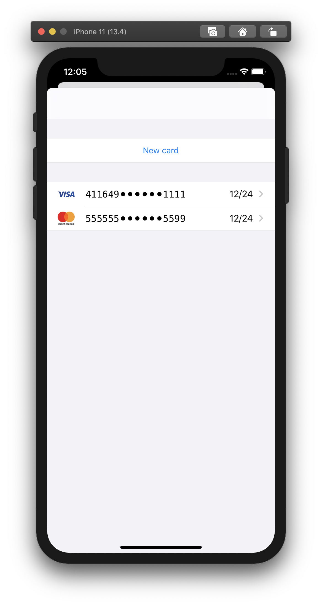
</div>

<div align="center"> Image 1. Controller in a modal window. </div>

## Working with bindings

### 1. Bindings display

A controller with the list of bindings will be displayed if the `bindings` array in `CardKConfing` is not an empty array.
If the array is empty, the form for creating a new card will be displayed.

Object Properties `CardKBinding`:

| Property name | Data type | Defaul value | Optional | Description      |
| :-----------: | :-------: | :----------: | :------: | ---------------- |
|   bindingId   |  Number   |      -       |    No    | Id bindings      |
| paymentSystem |  String   |      -       |    No    | Payment system   |
|  cardNumber   |  String   |      -       |    No    | Card number      |
|  expireDate   |  String   |      -       |    No    | Card expiry date |

<div align="center">
   
</div>

<div align="center"> Picture 2. List of bindings </div>

### 2. CVC field display

To display the CVC field in the payment form of the selected binding you must assign `true` value to `bindingCVCRequired` in `CardKConfing`.

```swift
  CardKConfig.shared.bindingCVCRequired = true;
```

An example of displaying a form when bindingCVCRequired = true or false

<div align="center">
  <div style="display: flex; justify-content: center;">
  <div>
    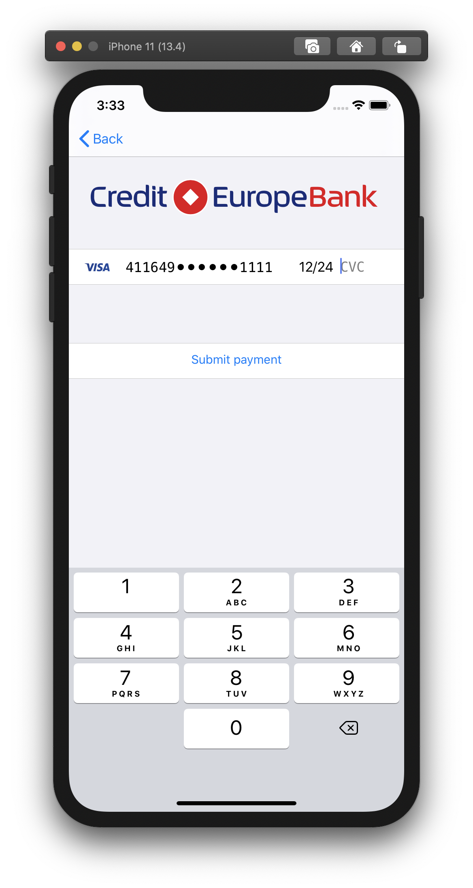
    <div align="center"> Image 3a. Field bindingCVCRequired = true </div>
  </div>
  <div>
    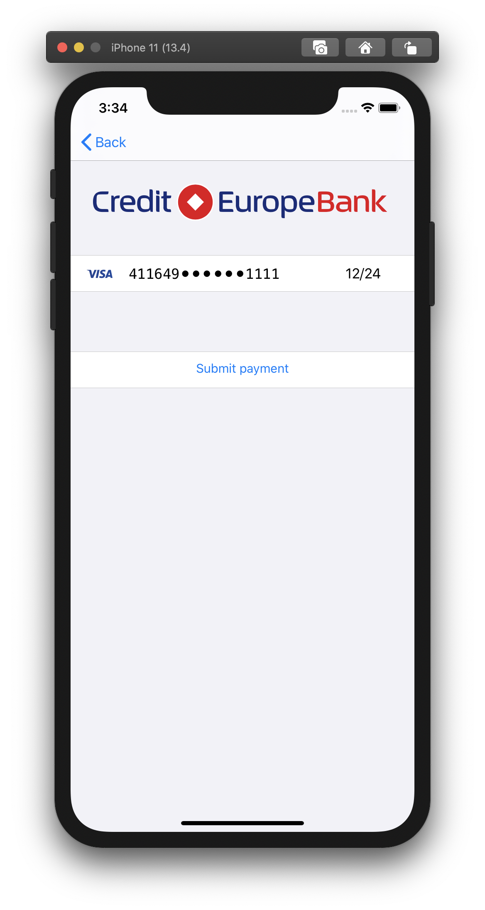
    <div align="center"> Image 3b. Field bindingCVCRequired = false </div>
  </div>
  </div>
</div>

## Displaying Cardholder field

To display the field you must assign `true` value to `displayCardHolderField` in `CardKViewController`.

```swift
controller.displayCardHolderField = true;
```

An example of displaying a form when displayCardHolderField = true or false

<div align="center">
  <div style="display: flex; justify-content: center;">
    <div>
      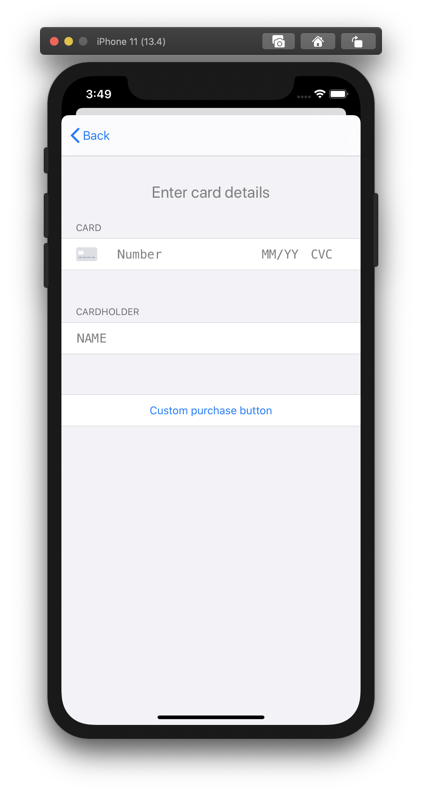
      <div align="center"> Image 4a. Field displayCardHolderField = true </div>
    </div>
    <div>
      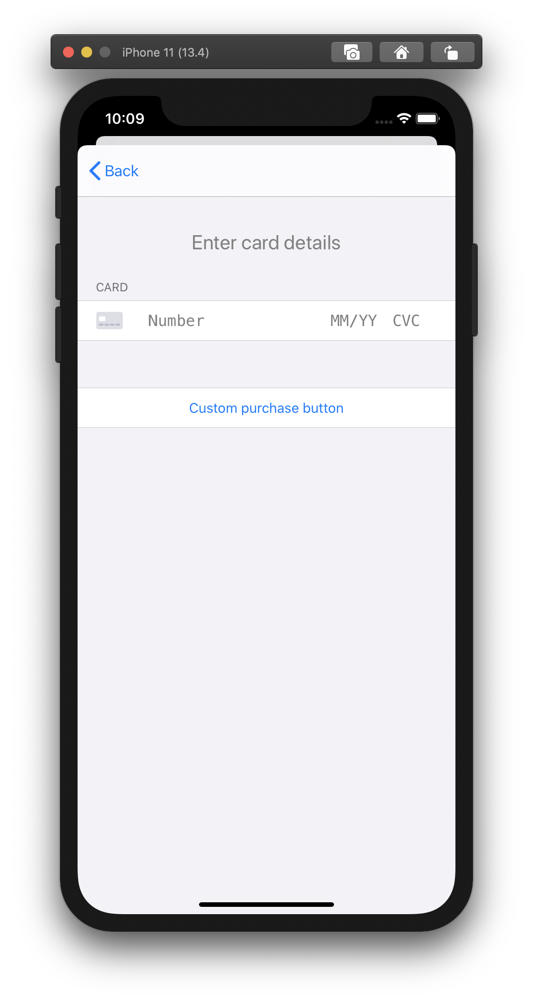
      <div align="center"> Image 4b. Field displayCardHolderField = false </div>
    </div>
  </div>
</div>

## Displaying the "Save Card" switch

To display the switch in the form, you must assign `true` value to `allowSaveBinding` in `CardKViewController`.
To control the default switch value, assign `isSaveBinding` value to `CardKViewController`.

```swift
controller.allowSaveBinding = true;
```

Example of a form display when allowSaveBinding = true or false

<div align="center">
  <div style="display: flex; justify-content: center;">
  <div>
   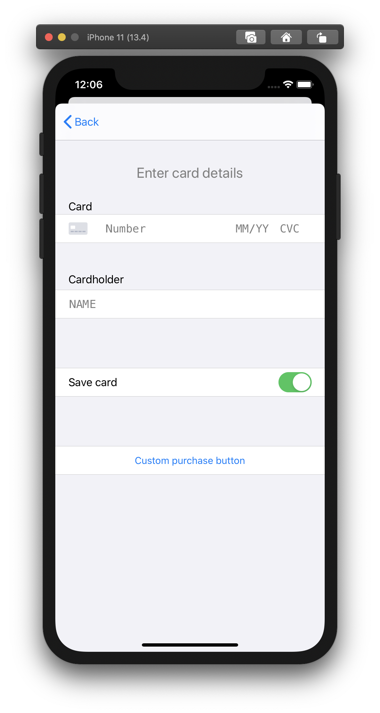
   <div align="center"> Image 5a. Field allowSaveBinding = true, isSaveBinding = true</div>
   </div>
   <div>
    
    <div align="center"> Image 5b. Field allowSaveBinding = false </div>
    </div>
    <div>
    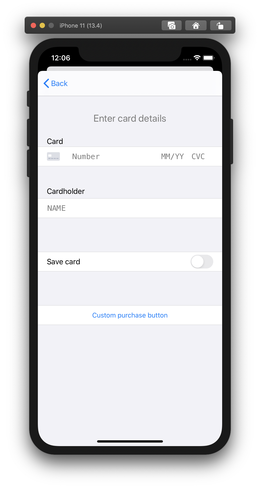
    <div align="center"> Image 5c. Field allowSaveBinding = false, isSaveBinding = false </div>
    </div>
  </div>
</div>

## IPad support. Displaying a form in Popover

1. Select a theme and initialize `CardKViewController`.

```swift
// ViewController.swift
CardKConfig.shared.theme = CardKTheme.dark();

let controller = CardKViewController();
controller.cKitDelegate = self;
let createdUiController = CardKViewController.create(self, controller: controller);
let navController = UINavigationController(rootViewController: createdUiController);
...
```

2. Check the IOS version of the current device. If the version is 13.0+ then display the form.

```swift
...
if #available(iOS 13.0, *) {
  self.present(createdUiController, animated: true)
  return;
}
...
```

3.  If version <13.0, initialize `UINavigationController` and assign `.formSheet` to the `modalPresentationStyle` attribute.

```swift
...
navController.modalPresentationStyle = .formSheet
...
```

4. Assign an object of class `UIBarButtonItem` to the `leftBarButtonItem` attribute in CardKViewController.

```swift
...
let closeBarButtonItem = UIBarButtonItem(
  title: "Close",
  style: .done,
  target: self,
  action: #selector(_close(sender:)) //The _close function is implemented below.
)
createdUiController.navigationItem.leftBarButtonItem = closeBarButtonItem
...
```

5. Displaying the form.

```swift
...
self.present(navController, animated: true)
```

**function \_close**

```swift
@objc func _close(sender:UIButton){
  self.navigationController?.dismiss(animated: true, completion: nil)
}
```

**Result: On the image 6 - IOS 13. On the image 7 - IOS 10.**

<div align="center">
   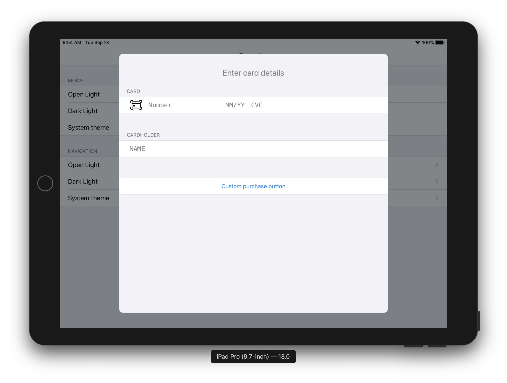
</div>

  <div align="center"> Image 6. Popover iPadOS 13 </div>

<div align="center">
   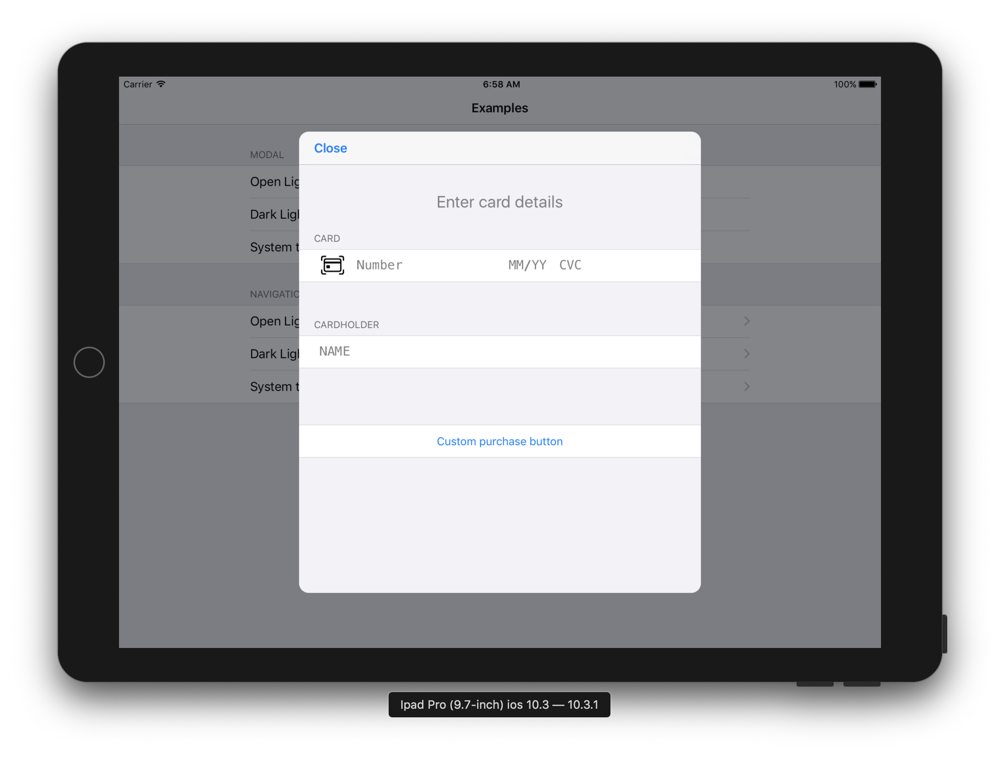
</div>

<div align="center"> Image 7. Popover iOS 10 </div>

## Displaying the form on a separate page

1. Select a theme and initialize `CardKViewController`.

```swift
// ViewController.swift
CardKConfig.shared.theme = CardKTheme.light();
let createdUiController = CardKViewController.create(self, controller: controller);
...
```

2. Add `CardKViewController` to `NavigationController`.

```swift
...
self.navigationController?.pushViewController(createdUiController, animated: true)
```

**Result**

<div align="center">
   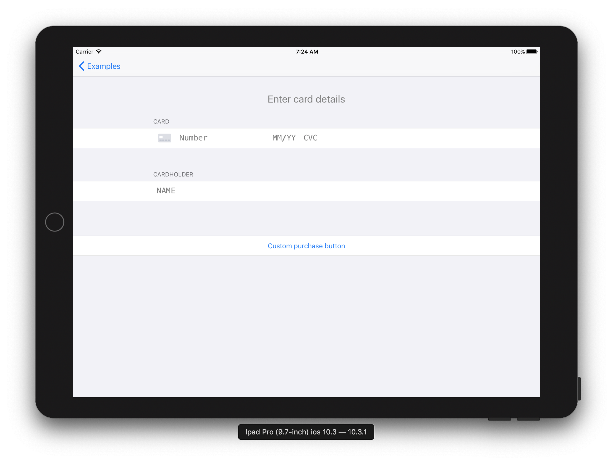
   <div align="center"> Image 8. Form on a separate page </div>
</div>

## Creating SeToken

To get the SeToken you need to implement the `cardKitViewController` function.

- cotroller - class object `CardKViewController`;
- didCreateSeToken - created `SeToken`.
- allowSaveBinding - the user's consent to save the new card details
- isNewCard - payment with a new card or bundle. A new card - `true`, bundle - `false`

```swift
// ViewController.swift
func cardKitViewController(_ controller: CardKViewController, didCreateSeToken seToken: String, allowSaveBinding: Bool, isNewCard: Bool) {
  debugPrint(seToken)
  ...
  controller.present(alert, animated: true)
}
```

## Setting up CardKViewController

To assign the СardKViewControler attributes with new parameters, you need to implement the didLoad function(\_ controller: CardKViewController)
In function `didLoad(\_ controller: CardKViewController)` controller attributes are assigned `CardKViewController`

```swift
//ViewController.swift
func didLoad(_ controller: CardKViewController) {
  controller.allowedCardScaner = CardIOUtilities.canReadCardWithCamera();
  controller.purchaseButtonTitle = "Custom purchase button";
  controller.allowSaveBinding = true;
  controller.isSaveBinding = true;
  controller.displayCardHolderField = true;
}
```

## Setting up the Apple pay button

1. Initialization of CardKPaymentView

```swift
let cardKPaymentView = CardKPaymentView.init(delegate: self);
cardKPaymentView.controller = self;
cardKPaymentView.frame = CGReact(x: 0, y: 0, width: 100, height: 100);
```

2. Setting up PKPaymentView

|   Argument name    |      Data type       | Default value | Optiona; | Description                          |
| :----------------: | :------------------: | :-----------: | :------: | ------------------------------------ |
|     merchantId     |        String        |     `nil`     |    No    | `merchantId` for apple pay           |
|   paymentRequest   |   PKPaymentRequest   |     `nil`     |    No    | Object to describe payment data      |
| paymentButtonType  | PKPaymentButtonType  |     `nil`     |    No    | ApplePay button type                 |
| paymentButtonStyle | PKPaymentButtonStyle |     `nil`     |    No    | ApplePay button style                |
|   cardPaybutton    |       UIButton       |     `nil`     |   Yes    | Setting up the "Pay by card" button" |

```swift
func willShow(_ paymentView: CardKPaymentView) {
  let paymentNetworks = [PKPaymentNetwork.amex, .discover, .masterCard, .visa]
  let paymentItem = PKPaymentSummaryItem.init(label: "Test", amount: NSDecimalNumber(value: 10))
  let merchandId = "t";
  paymentView.merchantId = merchandId
  paymentView.paymentRequest.currencyCode = "USD"
  paymentView.paymentRequest.countryCode = "US"
  paymentView.paymentRequest.merchantIdentifier = merchandId
  paymentView.paymentRequest.merchantCapabilities = PKMerchantCapability.capability3DS
  paymentView.paymentRequest.supportedNetworks = paymentNetworks
  paymentView.paymentRequest.paymentSummaryItems = [paymentItem]
  paymentView.paymentButtonStyle = .black;
  paymentView.paymentButtonType = .buy;

  paymentView.cardPaybutton.backgroundColor = .white;
  paymentView.cardPaybutton.setTitleColor(.black, for: .normal);
  paymentView.cardPaybutton.setTitle("Custom title", for: .normal);
}
```

**_Example of button display_**

<div align="center">
  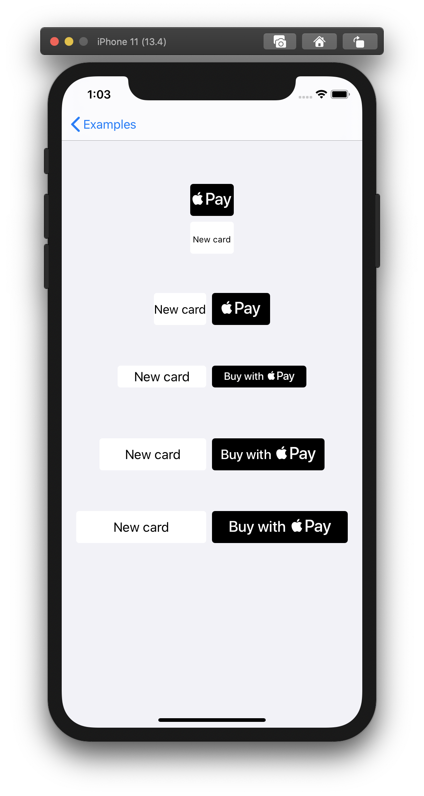
   <div align="center"> Image 9. Example of the Apple Pay button display </div>
</div>

3. Getting the payment result

To get PKPayment, you need to implement the function `cardKPaymentView`.

- paymentView - class object `CardKPaymentView`;
- pKPayment - payment result, class object PKPayment.

```swift
func cardKPaymentView(_ paymentView: CardKPaymentView, didAuthorizePayment pKPayment: PKPayment) {
...
}
```

## Working with Card.io

To work with Card.io you need:

1. Implement the `SampleAppCardIO` class with the `cardIOView` function;

- cardIOView - class object `CardIOView`;
- didScanCard - card data after scanning;

If there is card data, then call the `setCardNumber` function and assign the card data.

```swift
// ViewController.swift
class SampleAppCardIO: NSObject, CardIOViewDelegate {
  weak var cardKController: CardKViewController? = nil

  func cardIOView(_ cardIOView: CardIOView!, didScanCard cardInfo: CardIOCreditCardInfo!) {
    if let info = cardInfo {
      cardKController?.setCardNumber(info.cardNumber, holderName: info.cardholderName, expirationDate: nil, cvc: nil)
    }
    cardIOView?.removeFromSuperview()
  }
}
```

2. Implement the `cardKitViewControllerScanCardRequest function()`

- cotroller - class object `CardKViewController`;

```swift
// ViewController.swift
func cardKitViewControllerScanCardRequest(_ controller: CardKViewController) {
  let cardIO = CardIOView(frame: controller.view.bounds)
  cardIO.hideCardIOLogo = true
  cardIO.scanExpiry = false
  cardIO.autoresizingMask = [.flexibleWidth, .flexibleHeight]

  sampleAppCardIO = SampleAppCardIO()
  sampleAppCardIO?.cardKController = controller
  cardIO.delegate = sampleAppCardIO

  controller.showScanCardView(cardIO, animated: true)
}
```

3. assign `True` value to allowedCardScaner attribute. It is advisable to use the function `CardIOUtilities.canReadCardWithCamera()`;

4. call the function CardIOUtilities.preloadCardIO();

```swift
// ViewController.swift
func _openController() {
  ...
  controller.allowedCardScaner = CardIOUtilities.canReadCardWithCamera();
  ...
  CardIOUtilities.preloadCardIO()
}
```

## Theme overriding

Theme Properties:

| Number | Property name        |
| :----: | :------------------- |
|   1    | colorLabel           |
|   2    | colorPlaceholder     |
|   3    | colorErrorLabel      |
|   4    | colorCellBackground  |
|   5    | colorTableBackground |
|   6    | colorSeparatar       |
|   7    | colorButtonText      |

<div align="center">
  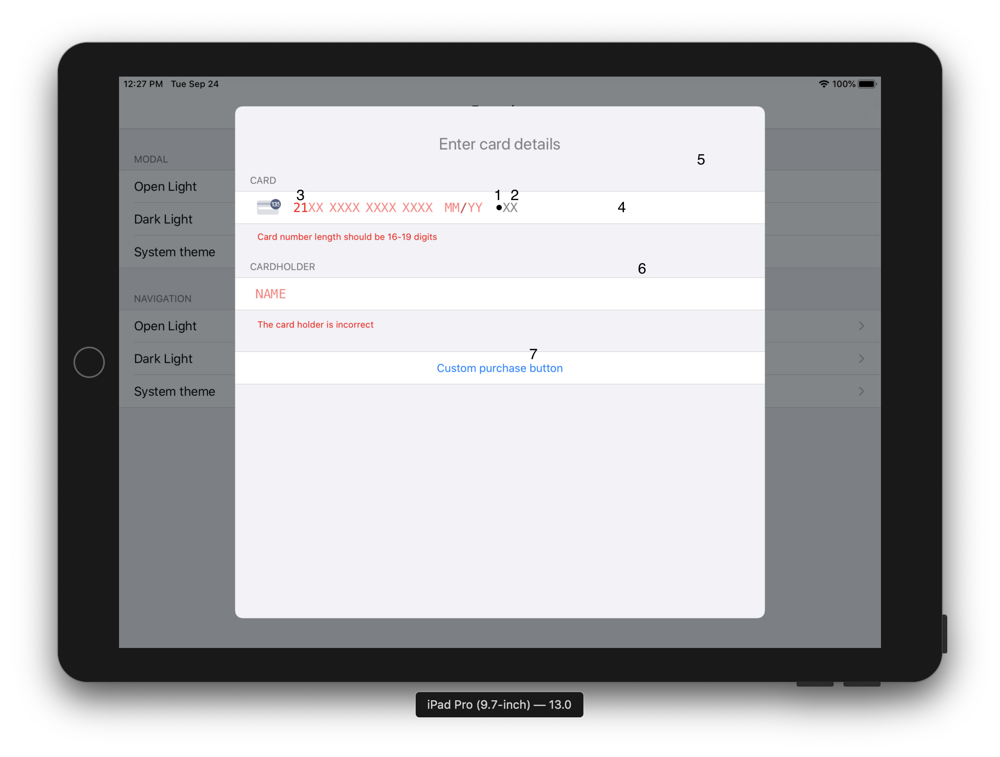
  <div align="center"> Image 10. Property numbering </div>
</div>

Example of overriding a theme:

```swift
func _openCustomTheme() {
  ...
  theme.colorLabel = UIColor.black;
  theme.colorPlaceholder = UIColor.gray;
  theme.colorErrorLabel = UIColor.red;
  theme.colorTableBackground = UIColor.lightGray;
  theme.colorCellBackground = UIColor.white;
  theme.colorSeparatar = UIColor.darkGray;
  theme.colorButtonText = UIColor.orange;
  ...
}
```
