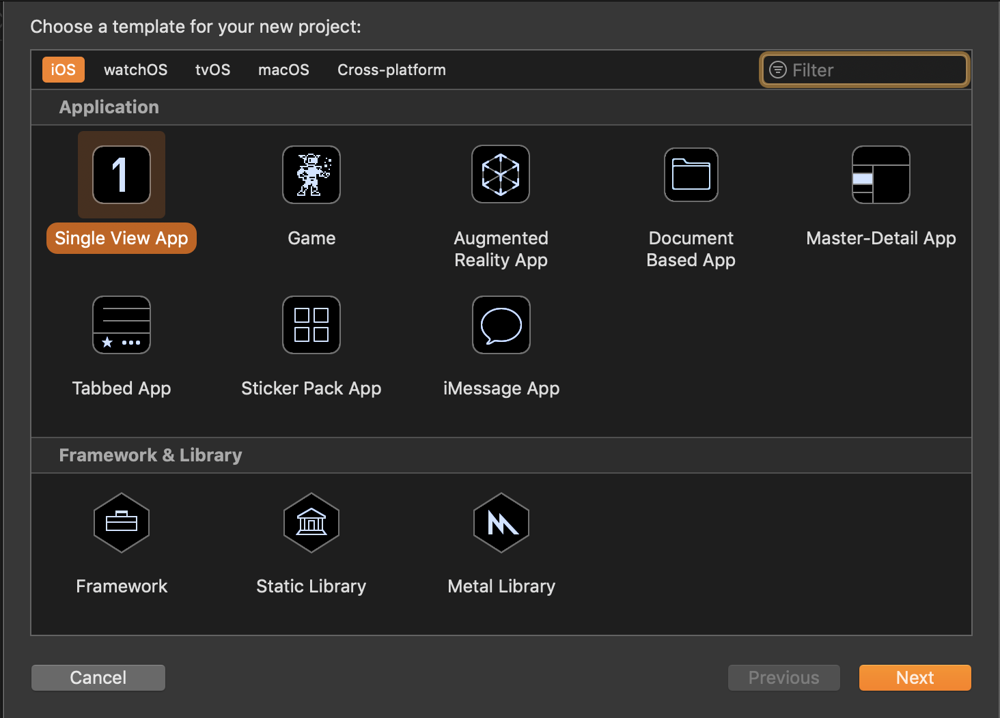
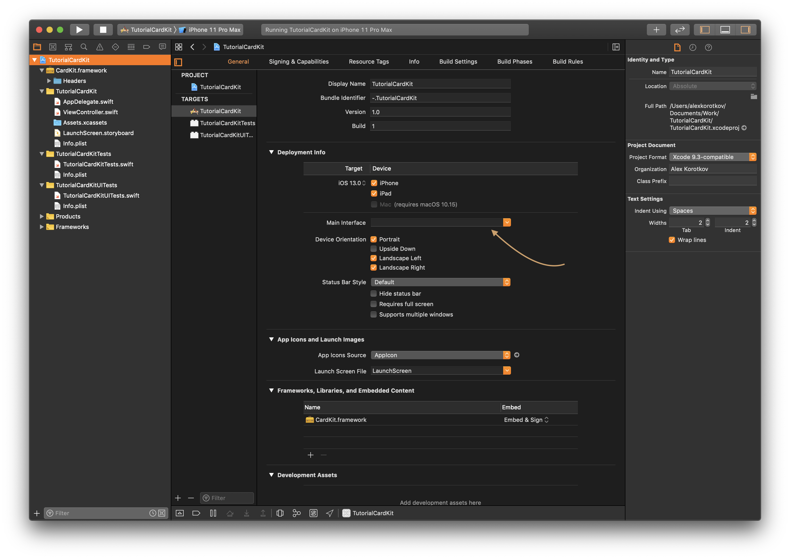
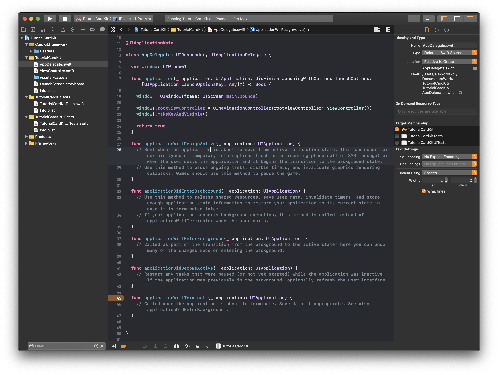
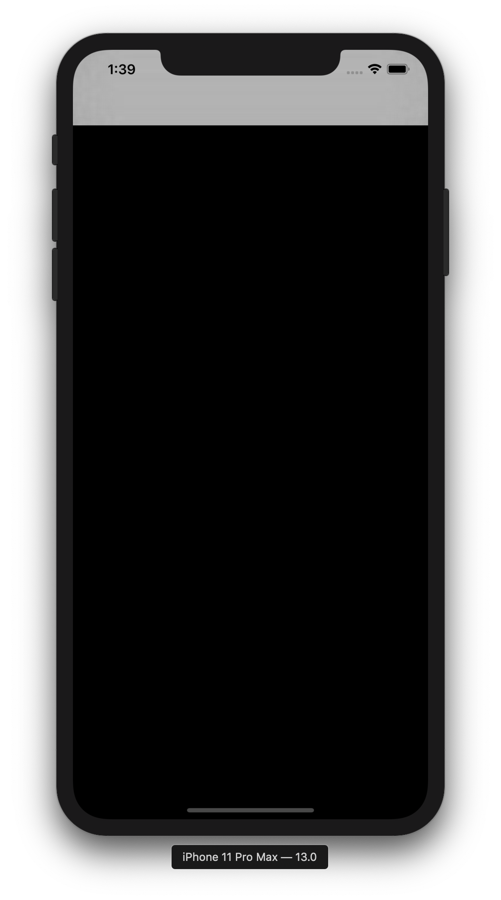
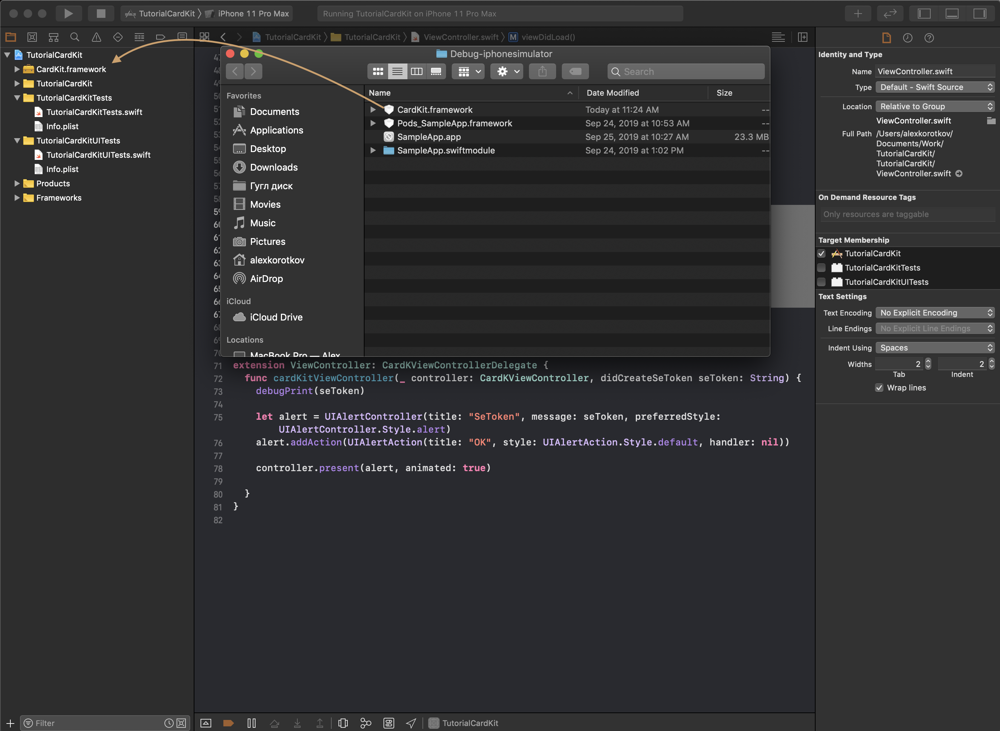
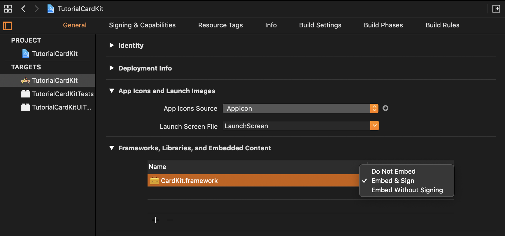
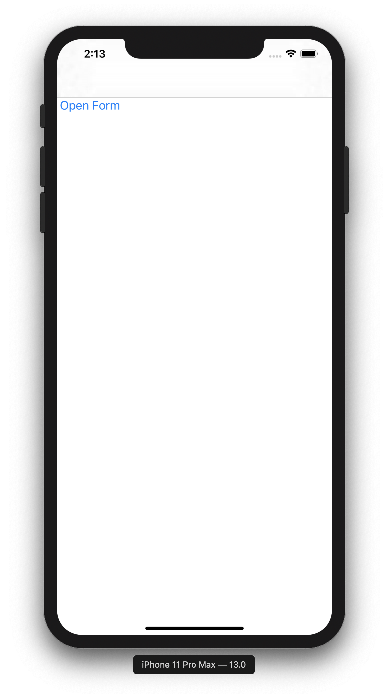
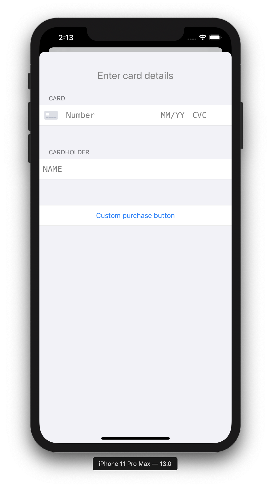

# CardKit SDK tutorial

The project setup is described below. Framework can be installed manually or via cocoapods or carthage.

To install using cocoapods in Podfile, add the line <br/>

`pod 'CardKit', :git => 'https://github.com/Runet-Business-Systems/CardKit.git'`
<br/>

`pod 'CardKitCore', :git => 'https://github.com/Runet-Business-Systems/CardKit.git`.

To install using carthage in Cartfile, add the line `github "Runet-Business-Systems/CardKit"`

After integrating the Cardkit, you should integrate the [3DS2_SDK](Tutorial3DS2.md)

## 1. Project Setup

1.1 Create a project

<div align="center">
  
</div>
  <div align="center"> Image 1.1. Project Creation </div>

1.2. Clear the `Main interface` field in Target

<div align="center">
  
</div>

  <div align="center"> Image 1.2. Empty field </div>

1.3 In AppDelegate.swift, initialize the ViewController as the first page.

```swift
//AppDelegate.swift
class AppDelegate: UIResponder, UIApplicationDelegate {

  var window: UIWindow?

  func application(_ application: UIApplication, didFinishLaunchingWithOptions launchOptions: [UIApplication.LaunchOptionsKey: Any]?) -> Bool {

    window = UIWindow(frame: UIScreen.main.bounds)

    window!.rootViewController = UINavigationController(rootViewController: ViewController())
    window!.makeKeyAndVisible()

    return true
  }
  ...
```

1.4 Implement functions in AppDegate.swift.

```swift
 ...
 func applicationWillResignActive(_ application: UIApplication) {}

  func applicationDidEnterBackground(_ application: UIApplication) {}

  func applicationWillEnterForeground(_ application: UIApplication) {}

  func applicationDidBecomeActive(_ application: UIApplication) {}

  func applicationWillTerminate(_ application: UIApplication) {}
}
```

<div align="center">
  
</div>
  <div align="center"> Image 1.3. AppDelegate.swift </div>

**Result:**

<div align="center">
  
</div>
  <div align="center"> Image 1.4. Work result </div>

## 2. CardKit.framework integration

You can integrate CardKit.framework in 3 ways.

- To add CardKit.framework manually
- TO install using Carthage
- To install using Pod

### 2.1 CardKit.framework

2.1.1 Take the file CardKit.framework and move the file to the project folder.

<div align="center">
  
</div>
  <div align="center"> Image 2.1. File moving CardKit.framework </div>

2.2.1 Open Targets -> General -> Frameworks,Libraries, and Embedded Content, In CardKit.framework, replace in the embeded column from `Do not Embed` with` Embed & Sign`.

<div align="center">
  
</div>
  <div align="center"> Image 2.2. Changing settings CardKit.framework </div>

2.3.1 Import framework in the ViewController.swift file

### 2.2 Carthage

2.2.1 Create Cartfile <br>
2.2.2 Add the line `github" Runet-Business-Systems / CardKit " to the file`

### 2.3 Pod

2.3.1 Initialize Pod <br>
2.3.2 Add the line `pod 'CardKit' to the Podfile, :git => 'https://github.com/Runet-Business-Systems/ios-sdk.git'`

```swift
//ViewController.swift
...
import CardKit
...
```

## 3. Using SDK

3.1 Implement cardKitViewController function

```swift
//ViewController.swift
extension ViewController: CardKDelegate {
  func cardKitViewController(_ controller: CardKViewController, didCreateSeToken seToken: String, allowSaveBinding: Bool, isNewCard: Bool) {
    debugPrint(seToken)

    let alert = UIAlertController(title: "SeToken", message: "allowSaveCard = \(allowSaveBinding) \n isNewCard = \(isNewCard) \n seToken = \(seToken)", preferredStyle: UIAlertController.Style.alert)
    alert.addAction(UIAlertAction(title: "OK", style: UIAlertAction.Style.default, handler: nil))

    controller.present(alert, animated: true)
  }
  ...
}
```

3.2 Implement the function `didLoad(\_ controller: CardKViewController)`

The function `didLoad(\_ controller: CardKViewController)` assigns attributes to `CardKViewController

```swift
//ViewController.swift
extension ViewController: CardKDelegate {
  ...
  func didLoad(_ controller: CardKViewController) {
    controller.allowedCardScaner = CardIOUtilities.canReadCardWithCamera();
    controller.purchaseButtonTitle = "Custom purchase button";
    controller.allowSaveBinding = true;
    controller.isSaveBinding = true;
    controller.displayCardHolderField = true;
  }
  ...
}
```

3.3 Implement a form call function

```swift
//ViewController.swift
...
@objc func _openController() {
  CardKConfig.shared.language = "";
  CardKConfig.shared.bindingCVCRequired = true;
  CardKConfig.shared.bindings = [];
  CardKConfig.shared.isTestMod = true;
  CardKConfig.shared.mdOrder = "mdOrder";

  if #available(iOS 13.0, *) {
    CardKConfig.shared.theme = CardKTheme.system();
  } else {
    CardKConfig.shared.theme = CardKTheme.default();
  };

  let controller = CardKViewController();
  controller.cKitDelegate = self

  let createdUiController = CardKViewController.create(self, controller: controller);
  let navController = UINavigationController(rootViewController: createdUiController);
  if #available(iOS 13.0, *) {
    self.present(createdUiController, animated: true)
    return;
  }

  navController.modalPresentationStyle = .formSheet

  let closeBarButtonItem = UIBarButtonItem(
    title: "Close",
    style: .done,
    target: self,
    action: #selector(_close(sender:))
  )
  createdUiController.navigationItem.leftBarButtonItem = closeBarButtonItem
  self.present(navController, animated: true)
}
...
```

3.4 Implement a form close function

```swift
//ViewController.swift
...
@objc func _close(sender:UIButton){
  self.navigationController?.dismiss(animated: true, completion: nil)
}
...
```

3.5 Add a button to call the form

```swift
 override func viewDidLoad() {
  super.viewDidLoad()

  let button = UIButton.init();
  button.setTitle("Open Form",for: .normal)
  button.addTarget(self, action:#selector(_openController), for: .touchUpInside)
  button.frame = CGRect(x: 0, y: 50, width: 100, height: 100)
  button.setTitleColor(UIColor.systemBlue, for: .normal)

  self.view.backgroundColor = UIColor.white
  self.view.addSubview(button)
}
```

**Result:**

<div align="center">
  <div style="display: flex; justify-content: center;">
  <div>
    
    <div align="center"> Image 3.1a. Button </div>
  </div>
  <div>
    
    <div align="center"> Image 3.2b. Card entry form </div>
  </div>
  </div>
</div>
