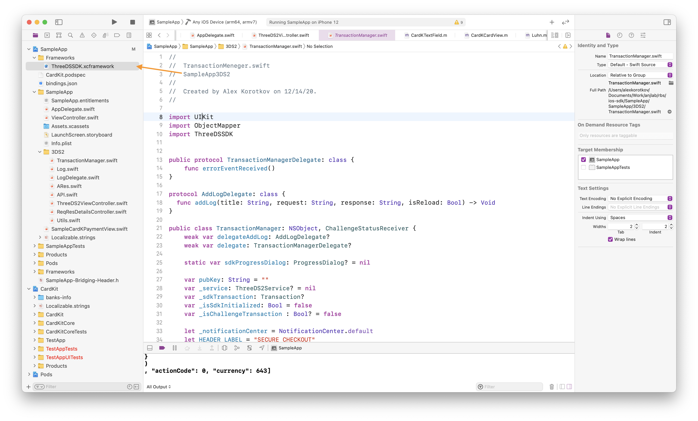
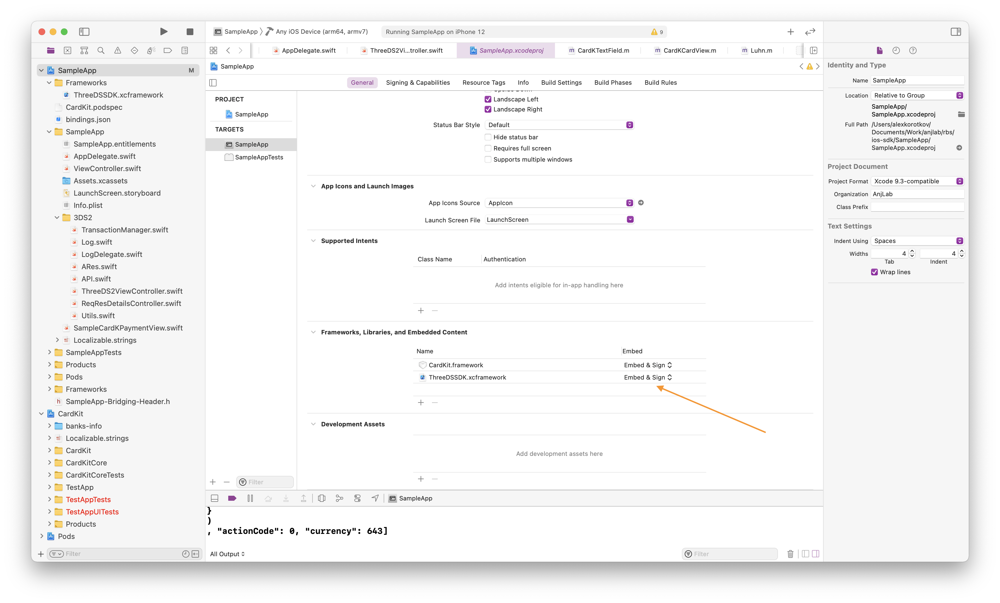

# Integration 3DS2 SDK

## 3DS2

For integration 3DS2 SDK:

1. Download and add ThreeDSSDK.xcframework in a project;

<div align="center">
  
</div>

2. Mark ThreeDSSDK.xcframework as `Embed & Sign` in tagrete -> general;

<div align="center">
  
</div>

3. Import ThreeDSSDK.

```swift
import ThreeDSSDK
...
```
4. Example

```swift
public class TransactionManager: NSObject {
  private pubKey: String = "pubKey"
  private directoryServerId: String = "directoryServerId"
  private var rootCI: String = "rootCertificateBase64"
  
  private var _service: ThreeDS2Service = Ecom3DS2Service()
  private var _sdkTransaction: Transaction?
  private var _sdkProgressDialog: ProgressDialog?
  
  public func initializeSdk() throws {
    try _service.initialize(configParameters: ConfigParameters(), locale: Locale.current.languageCode, uiCustomization: UiCustomization()))

    _sdkTransaction = try _service.createTransaction(directoryServerID: directoryServerId, messageVersion: nil, publicKeyBase64: pubKey, rootCertificateBase64: rootCI, logoBase64: "")

    _sdkProgressDialog = try _sdkTransaction!.getProgressView()
  }
  
   private func _executeChallenge(delegate: ChallengeStatusReceiver ,challengeParameters: ChallengeParameters, timeout : Int32) {
    DispatchQueue.main.async() {
      do {
        try self._sdkTransaction?.doChallenge(challengeParameters: challengeParameters, challengeStatusReceiver: delegate, timeOut: Int(timeout))
      } catch {
        self.close()
      }
    }
  }
}

extension TransactionManager {
  public func getAuthRequestParameters() throws -> ThreeDSSDK.AuthenticationRequestParameters {
    return try _sdkTransaction!.getAuthenticationRequestParameters();
  }

  public func handleResponse (responseObject: [String : String]){
    let challengeParameters = ChallengeParameters()
    challengeParameters.setAcsSignedContent(responseObject["acsSignedContent"]!)
    challengeParameters.setAcsRefNumber(responseObject["acsReferenceNumber"]!)
    challengeParameters.setAcsTransactionID(responseObject["acsTransID"]!)
    challengeParameters.set3DSServerTransactionID(responseObject["threeDSServerTransID"]!)
    
    _executeChallenge(delegate: self, challengeParameters: challengeParameters , timeout: 5)
  }
  
  public func showProgressDialog() {
    _sdkProgressDialog?.show()
  }

  public func closeProgressDialog() {
    _sdkProgressDialog?.close()
  }
  
  public func close() {
    do {
      try _sdkTransaction?.close()
    } catch {
      print("Can not close sdk transaction \(error.localizedDescription)")
    }
  }
}

extension TransactionManager: ChallengeStatusReceiver {
  private func _reloadTable() {
  }
  
  public func completed(completionEvent e: CompletionEvent) {
  }

  public func cancelled() {
  }

  public func timedout() {
  }

  public func protocolError(protocolErrorEvent e: ProtocolErrorEvent) {
  }
  
  public func runtimeError(runtimeErrorEvent: RuntimeErrorEvent) {
  }
}
```
